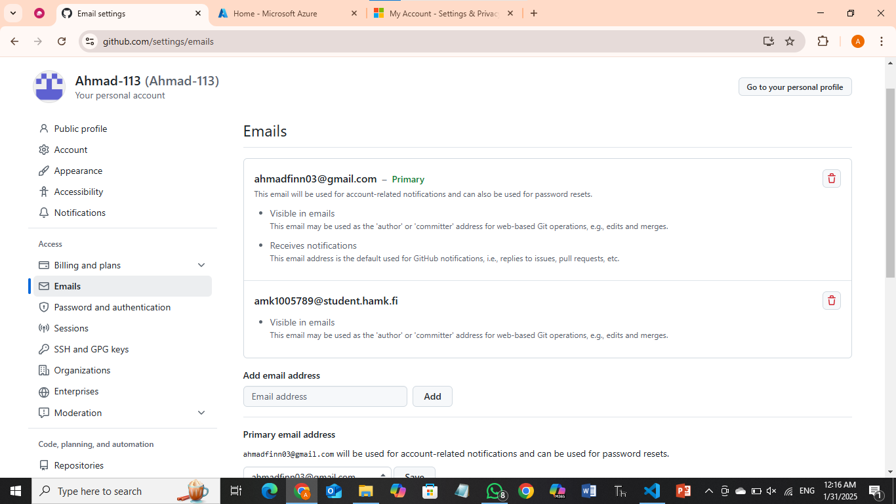
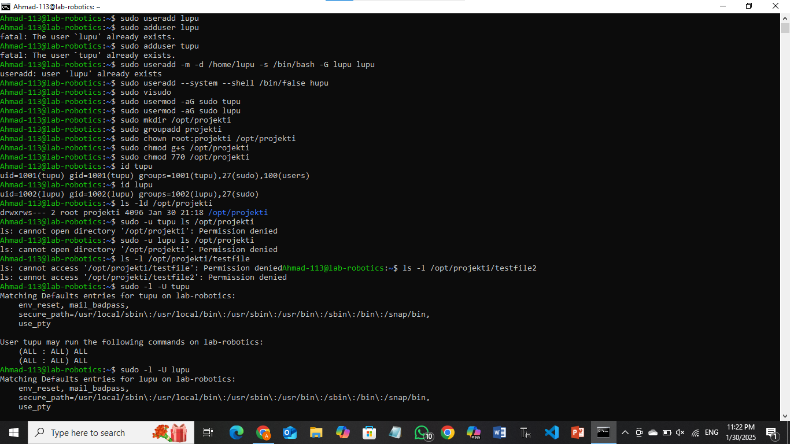
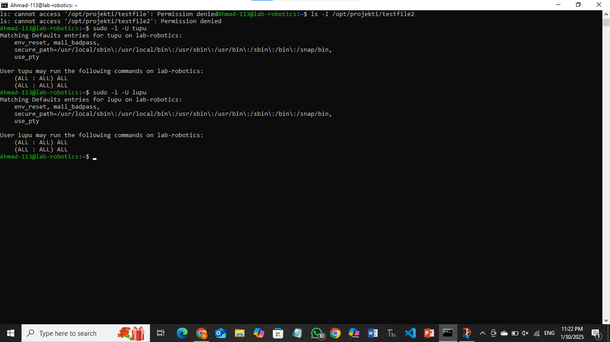

# Linux-management
# LINUX
# Azure Account Setup   
1. Created a Microsoft Azure account using my university-provided email address.  
2. Learned about cloud computing and its importance.  
3. Activated student benefits and set up a student account, receiving *$100* in Azure credits for use within the platform.  

# Virtual Machine Setup  
1. Created a virtual machine for coursework.  
2. Selected *Ubuntu Server 24.04 LTS Gen 2* from the Marketplace, published by Canonical.  
3. Named the virtual machine *"lab-robotics"*.  
4. Chose the *Standard_B2ls_v2* configuration from the B-series.  
5. Created a new resource group and subnet for organizing and allocating the machine.  

# GitHub Configuration  
1. Created a new repository named *"LINUX"* for the assignment.  
2. Added my HAMK email address as a secondary email to my GitHub account for version control.  



# Assignment 3: User Management and File System Access

## Step 1: Creating Users  
- First, I created two users: *tupu* and *lupu*.  
- Then, I set *passwords* and other necessary details to ensure only they can access their files.  
- I used the sudo and adduser commands for this:  

        sudo adduser tupu  

## Step 2: Creating the lupu User  
- Next, I created the lupu user using the useradd command:  

        sudo useradd -m -d /home/lupu -s /bin/bash -G lupu lupu  

  Explanation of flags:  
  - -m: Creates the user's home directory.  
  - -d /home/lupu: Specifies the home directory path.  
  - -s /bin/bash: Sets the login shell to Bash.  
  - -G lupu: Adds the user to the lupu group.  

## Step 3: Creating the hupu System User  
- Additionally, I created a system user named hupu, with the login shell set to */bin/false* to prevent login:  

        sudo useradd --system --shell /bin/false hupu  

  Explanation of flags:  
  - --system: Creates a system account.  
  - --shell /bin/false: Prevents the user from logging in.  

## Step 4: Granting Sudo Privileges  
- I used *visudo* to edit the sudoers file:  

        sudo visudo  

- Then, I added the following lines to grant sudo access to both users:  

        tupu ALL=(ALL:ALL) ALL  
        lupu ALL=(ALL:ALL) ALL  

- There are alternative methods to do this, but I chose this approach while testing both.  


## Step 5:
- I create directory in */opt/projekti* and add both users

        sudo mkdir /opt/projekti

- Then crete a group called projekti and assign both tupu and lupu into the group and the commands are:

        sudo groupadd projekti
        sudo usermod -aG projekti tupu
        sudo usermod -aG projekti lupu

- And give ownership to projekti group.

        sudo chown :projekti /opt/projekti

- And *set permission* so that tupu and lupu can access the file in all three formate like read, write and execute files.


        sudo chmod 770 /opt/projekti

- The following command ensures that any new files created within the /opt/projekti directory inherit the group ownership of projekti, maintaining the desired permissions.

        sudo chmod g+s /opt/projekti

## Output:

        drwxrws--- 2 root projekti 4096 Jan 30 16:02 /opt/projekti

### Here is the screenshots of the practical.




# Account Setup
- In  the first step, I'd create an Microsoft Azure account using email address that university provoded me.

- Then I got  to know about the cloud and it's importance. 

- Additionally, I explored student benefits  and open an student account and Azure give me **$100** worth of credits that I can use to purchase any pachage within the environment.


# Create Virtual Machine
- I created virtual machine where I have to work later on this course.

- Then I select Marketplace from **Ubuntu Server 24.04 LTS gen 2 Server** published by Canonical. 

- I named my machine **"lab-robotics"**.

- I choose B series version 2 which is **Standard_B2ls_v2**.

- Later, I create a new resource group for the machine and subnet to place the machine in.

# Link my HAMK email to my GitHub account

- I create a new repository named **"linux"** for the assignment.

- Then I add my HAMK email as a secondary mail for version control.

![mail]

# Assignment 3: User Management and File System Access

## Step 1: Creating Users
- Created two users: **tupu** and **lupu**.
- Set **passwords** and other necessary information to restrict access.
- Used `sudo` and `adduser` commands:

        sudo adduser tupu

## Step 2: Creating the Lupu User
- Used `useradd` command for `lupu`:

        sudo useradd -m -d /home/lupu -s /bin/bash -G lupu lupu

- Options explained:
  - `-m`: Create the home directory.
  - `-d /home/lupu`: Specify the home directory path.
  - `-s /bin/bash`: Set the login shell.
  - `-G lupu`: Add the user to the lupu group.

## Step 3: Creating the Hupu System User
- Created a system user `hupu` with login shell set to `/bin/false`:

       sudo useradd --system --shell /bin/false hupu

- Explanation:
  - `--system`: Create a system account.
  - `--shell /bin/false`: Prevent user login.

## Step 4: Granting Sudo Privileges
- Edited sudoers file using **visudo**:

        sudo visudo

- Added permissions:

        tupu ALL=(ALL:ALL) ALL
        lupu ALL=(ALL:ALL) ALL

- Alternatively, added users to the sudo group:

        sudo usermod -aG sudo tupu
        sudo usermod -aG sudo lupu

## Step 5: Setting Up `/opt/projekti` Directory
- Created directory:

        sudo mkdir /opt/projekti

- Created a group `projekti` and assigned both users:

        sudo groupadd projekti
        sudo usermod -aG projekti tupu
        sudo usermod -aG projekti lupu

- Set ownership and permissions:

        sudo chown :projekti /opt/projekti
        sudo chmod 770 /opt/projekti

- Ensured new files inherit `projekti` group ownership:

        sudo chmod g+s /opt/projekti

## Output
Expected directory permissions:

        drwxrws--- 2 root projekti 4096 Jan 30 16:02 /opt/projekti

## Screenshots
Here are the screenshots demonstrating the practical execution.


## APT Package Management Assignment

## **Part 1: Understanding APT & System Updates**

### **1. Check APT Version**
```bash
apt --version
```
**Output:**  _(apt --version
apt 2.7.14 (amd64)
**Screenshoot**
](https://github.com/user-attachments/assets/d54e510f-e4b0-421b-b22f-2b04edbe3dbb)

### **2. Update the Package List**
```bash
sudo apt update
```
**Explanation:** This command fetches the latest package lists from configured repositories, ensuring we get the latest versions and security updates.

### **3. Upgrade Installed Packages**
```bash
sudo apt upgrade -y
```
**Difference between `update` and `upgrade`:**  
- `update`: Refreshes the package list but doesn’t install updates.
- `upgrade`: Installs the latest versions of all packages listed in the updated package list.

### **4. View Pending Updates**
```bash
apt list --upgradable
```
**Pending Updates:**  Ahmad-113@lab-robotics:~$ apt list --upgradable
Listing... Done
---
## **Part 2: Installing & Managing Packages**

### **1. Search for an Image Editor**
```bash
apt search image editor
```
**Selected Package:**  zim 
### **2. View Package Details**
```bash
apt show zim
```
### Screenshot 
](https://github.com/user-attachments/assets/d9c217a2-6d27-4eee-ac50-1df4cf2ec5e9)

**Dependencies:** 
**Output (Key Information)**

Ahmad-113@lab-robotics:~$ apt show zim
Package: zim
Version: 0.75.2-1
Priority: optional
Section: universe/x11
Origin: Ubuntu
Bugs: https://bugs.launchpad.net/ubuntu/+filebug
Installed-Size: 5151 kB
Depends: python3-xdg, python3:any, python3-gi, gir1.2-gtk-3.0, xdg-utils
Recommends: gir1.2-gtkspell3-3.0
Suggests: bzr, git, mercurial, fossil, graphviz, ditaa, scrot, dvipng, gir1.2-gtksource-3.0, python3-zeitgeist, r-base, gnuplot, lilypond
Homepage: https://zim-wiki.org
Download-Size: 1215 kB
APT-Sources: http://azure.archive.ubuntu.com/ubuntu noble/universe amd64 Packages
Description: graphical text editor based on wiki technologies

What dependencies does it require?

python3
python3-gtk-3.0
gir1.2-gtk-3.0

### **3. Install the Package**
```bash
sudo apt install zim -y
```
### **4. Check Installed Package Version
apt list --installed | grep zim
### Part 3: Removing & Cleaning Packages
**1. Uninstall the Package
sudo apt remove zim -y
** Is the package fully removed?
- No, the configuration files are still on the system.
### ** 2. Remove Configuration Files
sudo apt purge zim -y

### Screenshot
](https://github.com/user-attachments/assets/9b5acf8d-033a-4f3b-a508-134a3af246a1)

# Difference between remove and purge:

- Remove: Deletes the package but keeps configuration files.
- Purge: Deletes both the package and its configuration files.

# 3. Clear Unnecessary Package Dependencies
sudo apt autoremove -y
# Why is this step important?

- It removes unneeded dependencies that were installed automatically.
- Frees up disk space.
### 4. Clean Up Downloaded Package Files
sudo apt clean
# What does this command do?

- It removes cached package files from /var/cache/apt/archives.
- Helps free up disk space.
### Part 4: Managing Repositories & Troubleshooting
*** 1. List All APT Repositories
cat /etc/apt/sources.list

### What do you notice in this file?

- It contains a list of repositories (deb or deb-src lines).
- Lists sources where packages are downloaded from.
# 2. Add the Universe Repository
sudo add-apt-repository universe
sudo apt update
# What types of packages are found in the universe repository?

- Community-maintained software, not officially supported by Ubuntu.
# 3. Simulate an Installation Failure and Troubleshoot
sudo apt install fakepackage
*** Output:
E: Unable to locate package fakepackage
# How would you troubleshoot this issue?

- Verify that the package name is correct.
- Run sudo apt update to refresh package lists.
- Check if the package is in the enabled repositories.
# Bonus Challenge (Optional)
# Hold a Package
sudo apt-mark hold zim
# Why would you want to hold a package?

- To prevent updates that might break compatibility.
### Unhold a Package
sudo apt-mark unhold zim
](https://github.com/user-attachments/assets/c1050337-158a-4254-b37e-3f247e887f9b)


# Part 1: Virtualization Concepts

### Research on Virtualization Concepts

Virtualization enables running multiple operating systems or applications on the same physical machine using a hypervisor. There are two main types of virtualization:

Full Virtualization (VMs): Uses a hypervisor to emulate hardware and run multiple OS instances.

Container-Based Virtualization: Uses OS-level isolation to run multiple applications in isolated user spaces.

# Part 2: Working with Multipass

# Installing Multipass

```bash
sudo snap install multipass
```
### Basic Multipass Commands

### Launching a Default Ubuntu Instance
```bash
multipass launch --name test-vm
```
### Listing Instances
```bash
multipass list
```
### Accessing the Instance Shell
```bash
multipass shell test-vm
```
### Cloud-init Configuration

### Created a cloud-init.yaml file:
```bash
#cloud-config
package_update: true
packages:
  - nginx
  - htop
users:
  - name: student
    sudo: ['ALL=(ALL) NOPASSWD:ALL']
```
### Screenshot 


### Launching a Multipass VM with Cloud-Init
```bash
multipass launch --name my-cloud-vm --cloud-init cloud-init.yaml
```
### Verifying Nginx Installation
```bash
multipass shell my-cloud-vm
systemctl status nginx
```
# Screenshot


# Part 3: Exploring LXD

### Installing and Initializing LXD
```bash
sudo apt update
sudo apt install -y lxd
```
### Creating container
```bash
lxc launch ubuntu:20.04 my-container
lxc list
lxc exec my-container -- bash
lxc stop my-container
lxc delete my-container
```


### Part 4: Working with Docker

# Installing Docker
# Installing and Initializing LXD
# Installing and Initializing LXD
```bash
sudo apt update
sudo apt install -y docker.io
sudo systemctl enable --now docker
```
# Creating a Simple Dockerfile
### Installing and Initializing LXD
```bash
FROM ubuntu:20.04
RUN apt update && apt install -y nginx
CMD ["nginx", "-g", "daemon off;"]
```

### Screenshot


# Part 5: Working with Snaps
### Installing Snapcraft
```bash
sudo snap install snapcraft --classic
```
# Packaging a Simple App into a Snap
### Created a snapcraft.yaml file:
```bash
name: my-snap
base: core20
version: '1.0'
summaries: My first snap
architectures: [amd64]
apps:
  my-app:
    command: echo "Hello, Snap!"
```
# Screenshot


# Server Firewall Configuration Report

## Rule Analysis

Below is an in-depth analysis of each rule implemented in our firewall configuration:

### 1. Allow SSH Access

```bash
sudo iptables -A INPUT -p tcp --dport 22 -j ACCEPT
```

**Purpose**: This rule allows incoming SSH connections on the standard port 22.

**Justification**: SSH access is necessary for remote administration of the server. Without this rule, remote management would be impossible if the default policy is set to DROP or REJECT.

### 2. Allow Established and Related Connections

```bash
sudo iptables -A INPUT -m state --state ESTABLISHED,RELATED -j ACCEPT
```

**Purpose**: This rule permits packets that are part of established connections or related to existing connections.

**Justification**: For proper network functionality, the server needs to receive responses to outgoing connections it initiated. This rule ensures that ongoing communications are not disrupted by the firewall.

### 3. Set Default Policy for Outgoing Traffic

```bash
sudo iptables -P OUTPUT ACCEPT
```

**Purpose**: Sets the default policy for outbound traffic to ACCEPT.

**Justification**: This allows the server to initiate outgoing connections without restrictions, which is generally safe since the threat model primarily focuses on incoming traffic.

### 4. Allow HTTP Traffic

```bash
sudo iptables -A INPUT -p tcp --dport 80 -j ACCEPT
```

**Purpose**: Permits incoming HTTP connections on the standard port 80.

**Justification**: Necessary for web server functionality, allowing users to access web content hosted on the server.

### 5. Allow HTTPS Traffic

```bash
sudo iptables -A INPUT -p tcp --dport 443 -j ACCEPT
```

**Purpose**: Allows incoming HTTPS connections on the standard port 443.

**Justification**: Required for secure web communications through SSL/TLS, enabling encrypted data transfer between clients and the server.

### 6. SYN Flood Protection

```bash
sudo iptables -A INPUT -p tcp --syn -m limit --limit 1/s -j ACCEPT
```

**Purpose**: Limits the rate of new TCP connections with the SYN flag to 1 per second.

**Justification**: Protects against SYN flood attacks, which attempt to consume server resources by sending a large number of SYN packets without completing the TCP handshake.

### 7. NULL Packet Protection

```bash
sudo iptables -A INPUT -p tcp --tcp-flags ALL NONE -j DROP
```

**Purpose**: Drops packets with no TCP flags set (NULL packets).

**Justification**: NULL packets are often used in network reconnaissance and can indicate a port scan. Legitimate traffic should never have all TCP flags unset, making this an effective rule to block certain types of scanning activity.

### 8. Log Blocked Traffic

```bash
sudo iptables -A INPUT -j LOG --log-prefix "BLOCKED: "
```

**Purpose**: Logs all packets that reach this rule (which would be all packets not matched by previous rules).

**Justification**: Provides visibility into blocked traffic, aiding in threat analysis and firewall rule optimization.

### 9. Log New Allowed Connections

```bash
sudo iptables -I INPUT 1 -m state --state NEW -j LOG --log-prefix "ALLOWED: "
```

**Purpose**: Logs all new connections that are allowed through the firewall.

**Justification**: Helps monitor legitimate traffic and detect anomalies in access patterns, valuable for security auditing.

### 10. Save Firewall Rules

```bash
sudo iptables-save > /etc/iptables.rules
sudo iptables-save | sudo tee /etc/iptables.rules > /dev/null
```

**Purpose**: Saves the current iptables configuration to a file.

**Justification**: Ensures rules can be restored after a system reboot.

### 11. Restore Rules at Boot

```bash
sudo sh -c "echo 'iptables-restore < /etc/iptables.rules' >> /etc/rc.local"
sudo chmod +x /etc/rc.local
```

**Purpose**: Configures the system to restore iptables rules on boot.

**Justification**: Ensures continuous protection even after server restarts.

## Additional Protection Against Common Attacks

In addition to SYN flood protection, our firewall configuration addresses several other common types of network attacks. Below are additional rules implemented:

### Protection Against Port Scanning (Added Rule)

```bash
sudo iptables -A INPUT -p tcp -m tcp --tcp-flags FIN,SYN,RST,PSH,ACK,URG NONE -j DROP
sudo iptables -A INPUT -p tcp -m tcp --tcp-flags FIN,SYN FIN,SYN -j DROP
sudo iptables -A INPUT -p tcp -m tcp --tcp-flags SYN,RST SYN,RST -j DROP
sudo iptables -A INPUT -p tcp -m tcp --tcp-flags FIN,RST FIN,RST -j DROP
sudo iptables -A INPUT -p tcp -m tcp --tcp-flags FIN,ACK FIN -j DROP
sudo iptables -A INPUT -p tcp -m tcp --tcp-flags PSH,ACK PSH -j DROP
sudo iptables -A INPUT -p tcp -m tcp --tcp-flags ACK,URG URG -j DROP
```

**Purpose**: Blocks packets with invalid TCP flag combinations.

**Justification**: These rules protect against various stealth port scanning techniques (like XMAS scans, FIN scans, NULL scans) by dropping packets with illogical TCP flag combinations that would never occur in normal traffic but are often used in reconnaissance.
